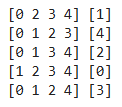

# Synthetic Data Classification & K-Fold CV 📊


*Visualizing the train/test index splits in a 5-Fold Cross Validation process.*

## 📖 Project Overview
This project serves as a tutorial on applying **K-Fold Cross Validation** to evaluate machine learning models. Using a synthetically generated dataset, the notebook demonstrates how to robustly assess model performance and compare different algorithms beyond simple train/test splits.

The primary goal is to understand how cross-validation provides a more reliable estimate of a model's accuracy on unseen data.

## 🛠️ Methodology
1.  **Data Generation:** Created a synthetic binary classification dataset using `sklearn.datasets.make_classification` with 10 features and 1000 samples.
2.  **Baseline Model:** Trained a Logistic Regression model on a standard 75/25 train-test split to establish a baseline performance.
3.  **K-Fold Implementation:**
    * Demonstrated the inner workings of `KFold` by printing index splits.
    * Manually iterated through folds to train and score a model.
4.  **Model Comparison via CV:** Used `cross_val_score` to benchmark three classifiers:
    * **Logistic Regression:** Linear baseline.
    * **Decision Tree:** Non-linear baseline.
    * **Random Forest:** Ensemble method (evaluated with 10, 20, and 30 trees).
5.  **Advanced Metrics:** Utilized `cross_validate` to retrieve multiple metrics (Accuracy and ROC-AUC) simultaneously.

## 📊 Key Results (5-Fold CV Accuracy)
| Model | Average Accuracy | Stability |
| :--- | :--- | :--- |
| **Logistic Regression** | ~69% | Consistent |
| **Decision Tree** | ~78% | Moderate Variance |
| **Random Forest (10 Trees)** | ~86% | High |
| **Random Forest (30 Trees)** | **~87%** | Highest |

*Note: Random Forest consistently outperformed other models on this synthetic dataset.*

## 💻 Technologies Used
* Python
* Scikit-learn (Data generation, Modeling, Cross-Validation)
* NumPy
* Matplotlib

## 🚀 How to Run
1.  Clone the repository.
2.  Install dependencies:
    ```bash
    pip install numpy matplotlib scikit-learn
    ```
3.  Run the Jupyter Notebook:
    ```bash
    jupyter notebook "Synthetic Data Classification & K-Fold CV.ipynb"
    ```
